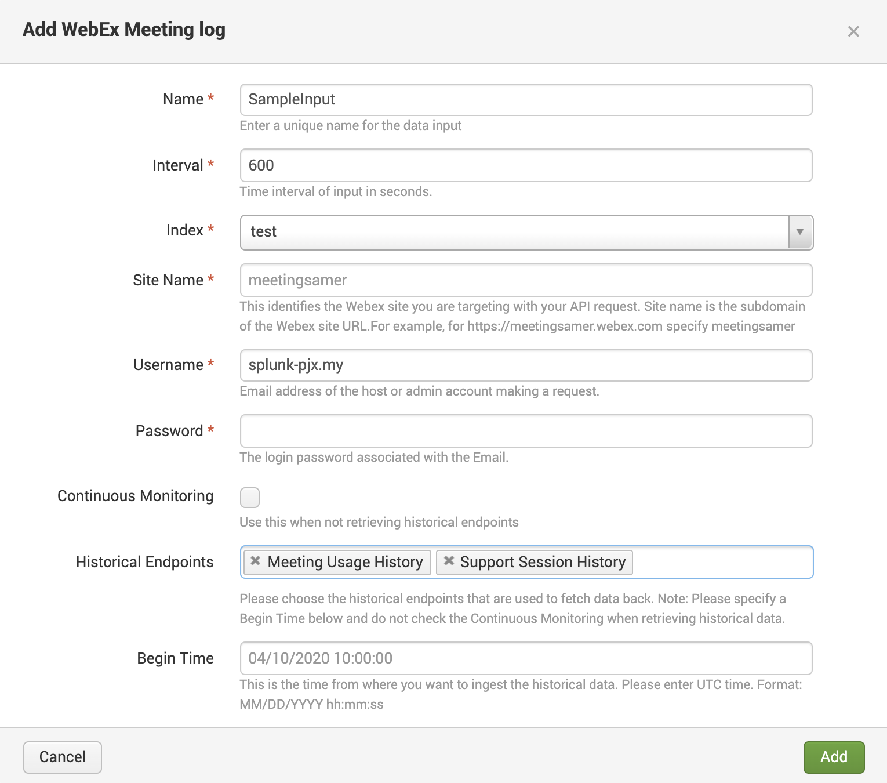

# Splunk-TA for WebEx Meetings

> The **Splunk-TA for Webex Meetings** uses the _Webex Meetings XML API_ to fetch data and ingest it into Splunk.

## Getting Started
This is a TA to pull in data from WebEx Meetings XML API. 
The `LstmeetingusageHistory` [API endpoint](https://developer.cisco.com/docs/webex-xml-api-reference-guide/#!lstmeetingusagehistory) is being hit to fetch data for the meetings. 

#### Installation and Configuration Steps
This application can be installed on-prem and cloud. The TA can be downloaded from the [JIRA ticket](https://jira.splunk.com/browse/FDSE-612) / [Drive link](https://drive.google.com)

##### Installation Steps for `on-prem`
Install the TA on one of the Heavy Forwarder(s).

##### Installation Steps for `cloud`
Create a support ticket with `APP-CERT` reference to get it installed on the Cloud instance *OR* follow the cloud-ops steps to install non-published applications.

#### Configuration steps
The configuration steps are common for `on-prem` and `cloud`. Please follow the following steps in order:
1. Open the Web UI for the Heavy Forwarder (or IDM).
2. Access the TA from the list of applications.
3. Click on `Add New Input` button on the top right corner.
4. Enter the following details:
  - **Site Name** (_required_): This identifies the Webex site you are targeting with your add-on. For example, if the URL is `https://splunk.webex.com`, the Webex Site that you have to enter is `splunk`.
  - **Username** (_required_): E-mail address of the host or admin account making the request. For example: `splunker@splunk.com`.
  - **Password** (_required_): Password of the account associated with the e-mail address above. The password will be masked.
  - **Begin Time** (_required_): This is the timeframe starting from where you want to ingest the data. Format for the Start Time would be `MM/DD/YYYY hh:mm:ss`.
  - **End Time** (_optional_): This is the timeframe until you want to ingest the data . Format for the End Time would be `MM/DD/YYYY hh:mm:ss`.
5. Click on the `Add` green button on the bottom right of the pop up box.
6. Please check for any errors and resolve them before using the search app to check for the pulled-in data.

## Example(s)

## Credits & Acknowledgements (optional)
> Please feel free to contact fdse@splunk.com or #team-fdse on Slack for any more information.